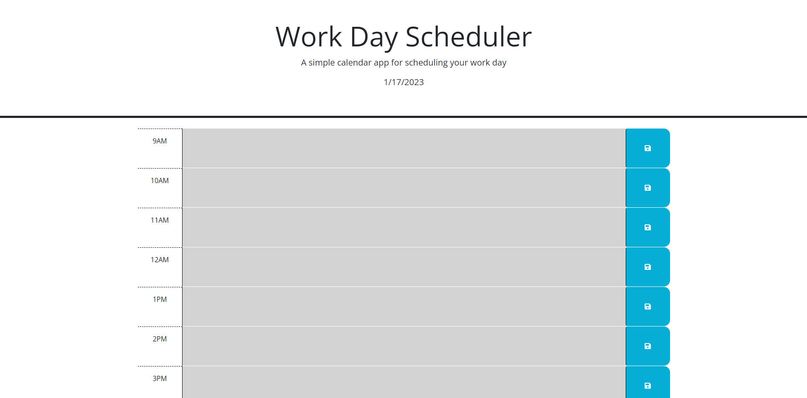

 # Daily Planner
This is a simple daily planner application that allows the user to save their schedule for the day. The application displays the current date in the header, and has time blocks for every hour between 9am and 5pm. The user can enter a task or event in the text area of each time block, and save it using the save button. The application uses local storage to save the user's input, so the tasks will still be there even if the page is refreshed.

The time blocks are color-coded to indicate whether the hour is in the past, present, or future. Past time blocks are gray, present time blocks are red, and future time blocks are green.

# Getting Started
Download the files from the repository.
Open the index.html file in your browser.
Start entering your tasks and events in the text areas.
Use the save button to save your input.
Refresh the page to see your saved tasks and events.

# Built With
HTML
CSS
JQuery

# Authors
Jane Collazo
